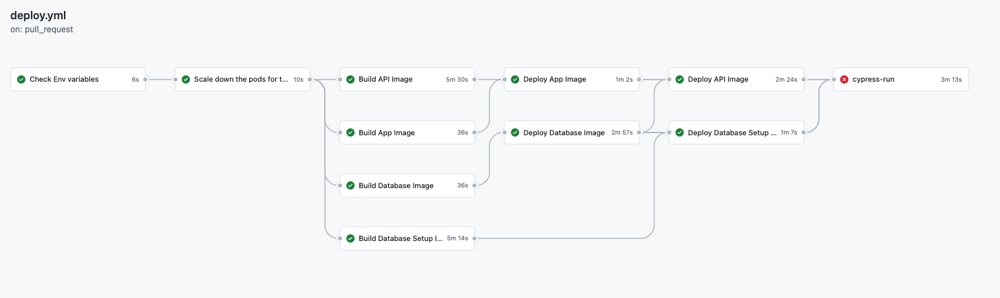
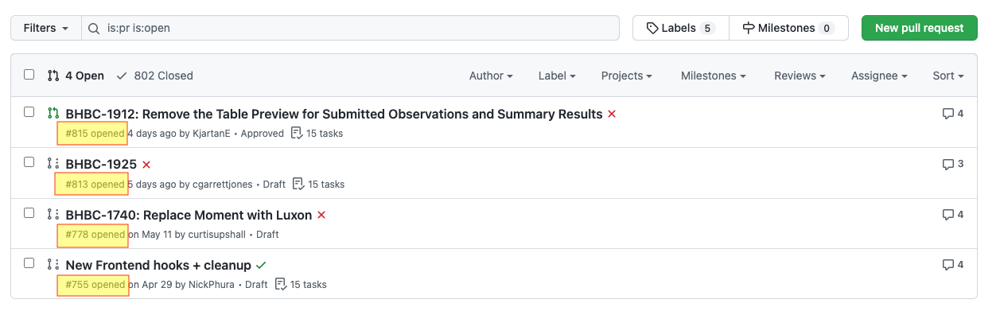
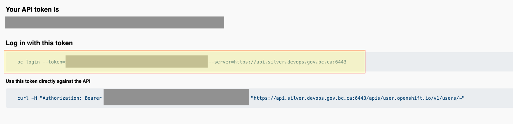

#Pod Management

## When a pod fails repeatedly 
### drop the pods for a clean build and deploy

This typically happens for the db-setup pod when migrations are in flux.

For example:Cypress Pod failed



Log into openshift

```
https://console.apps.silver.devops.gov.bc.ca/k8s/cluster/projects
```

Select project: a0ec71

Find your PR number (the example beloow shows PR numbers in yellow): 



## Drop your pods

From openshift, grab your login credentials


### you'll see your project list
ensure the asterix is next to a0ec71.

If not, use 'oc get project <project_name>' to switch to the intended project.  Use 'oc projects' to confirm the correct project is selected


The following command will delete all pods secrets and persistent volumes related to your PR instance.

oc delete all,secret,pvc --selector env-id=<enter_your_PR_number_here>

This may take a couple of minutes to finish.

Caution:  the above command.
